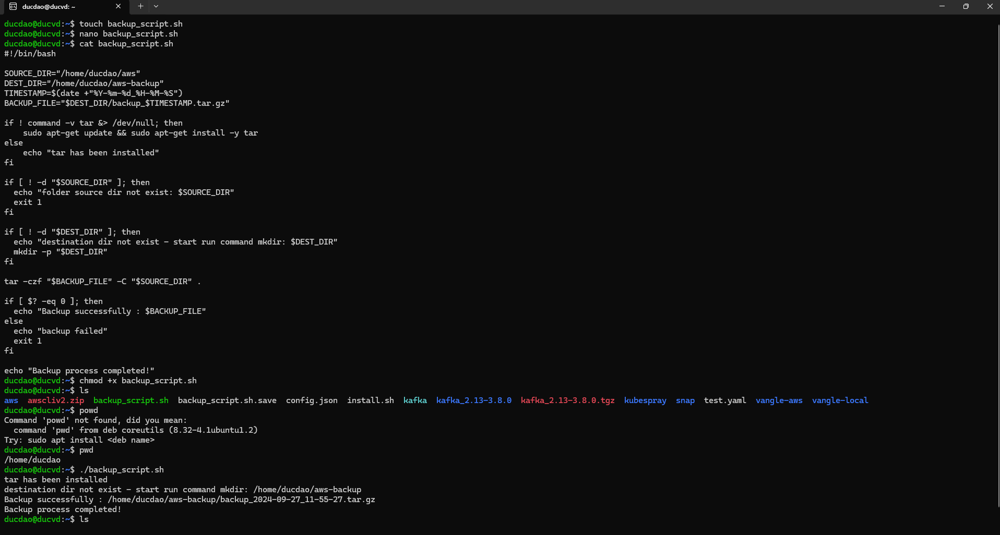
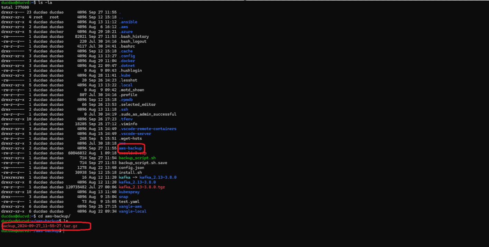

Step1: tạo tệp backup_script.sh và cấp quyền thực thi cho tệp backup_script
```bash
touch backup_script.sh
chmod +x backup_script.sh
```

Step2: copy nội dung trong tệp lab01/backup_script.sh và dán vào tệp backup_script
```bash
nano backup_script.sh
```
sau đó ctrl+x và save lại

thực thi tệp bash script trên
```bash
./backup_script.sh
```
kết quả


kiểm tra kết quả backup
