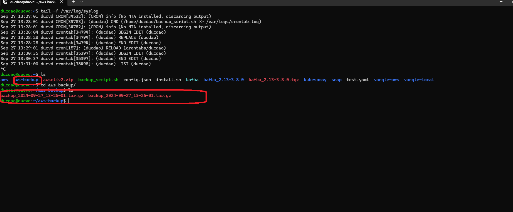

Step1: copy nội dung file backup_script.sh trong thư lab02 và gán quyền thực thi
## Nội dung file này giống với lab 01
```bash
touch backup_script.sh
chmod +x backup_sript.sh
nano backup_script.sh
```


step2: chỉnh sử crontab config
## 0 2 * * * /home/ducdao/backup_script.sh chỉ định sẽ chạy file backup_script.sh vào 2h hàng ngày

```bash
crontab -e
```

kiểm tra crontab bằng câu lệnh
```bash
crontab -l
```
kết quả


#Để thực hiện test crontab tôi sử giá trị cron thành thực thi 1phút/lần


## chờ 1 phút và verify kết quả:
kiểm tra syslog

```bash
tail -f /var/log/syslog
```
kết quả


verify output
