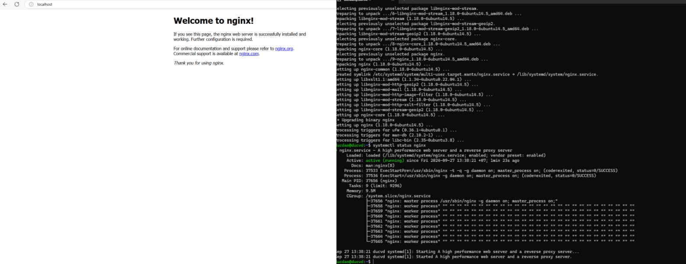
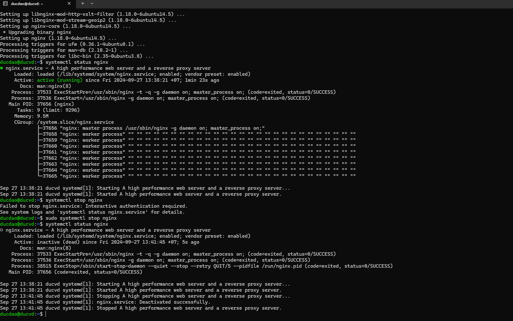
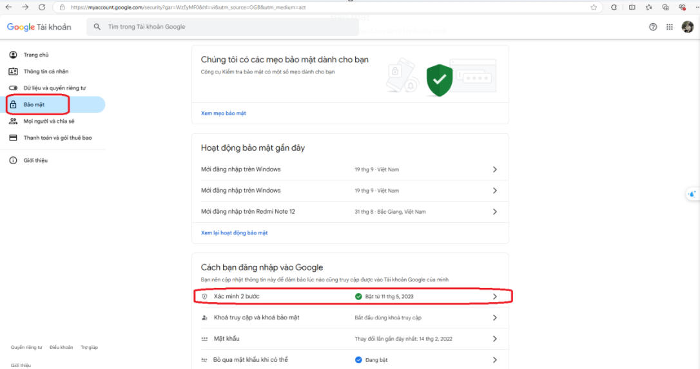
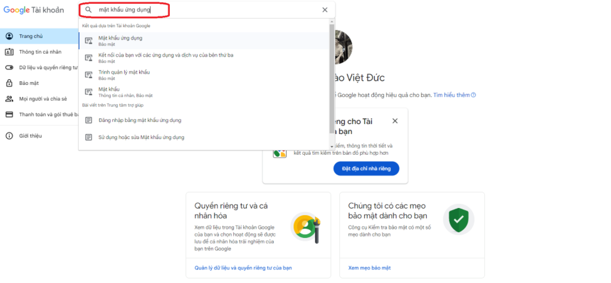
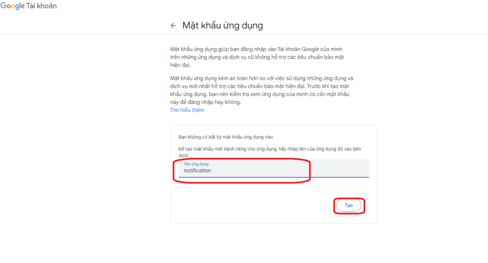
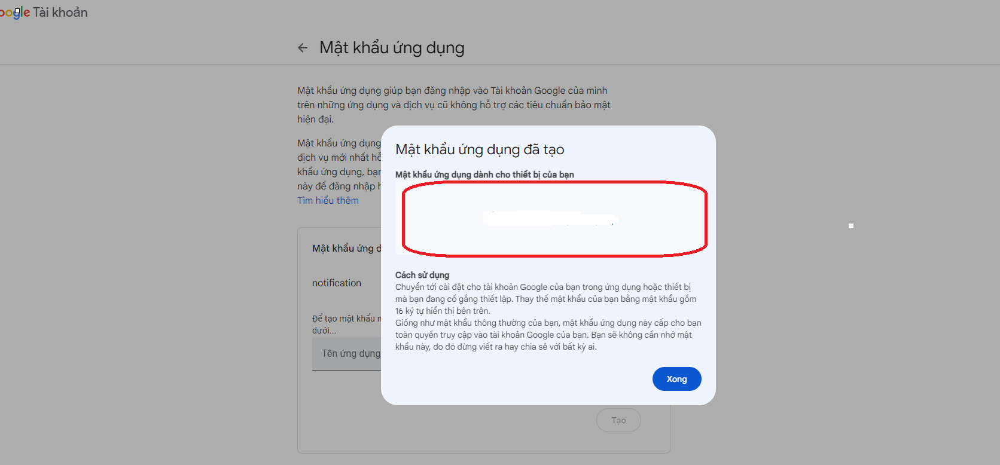
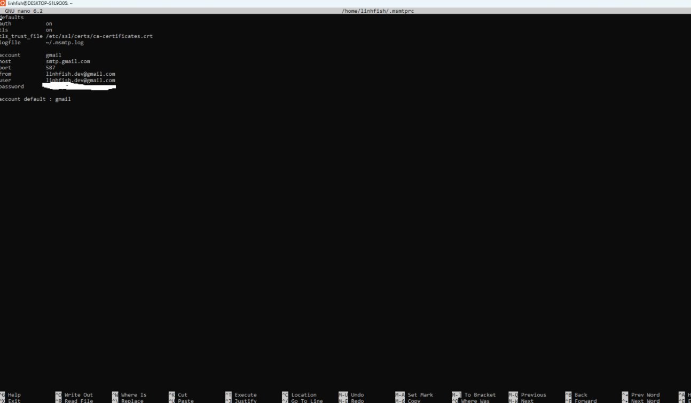
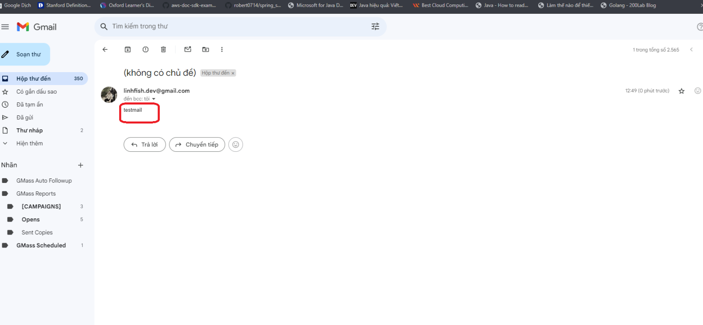
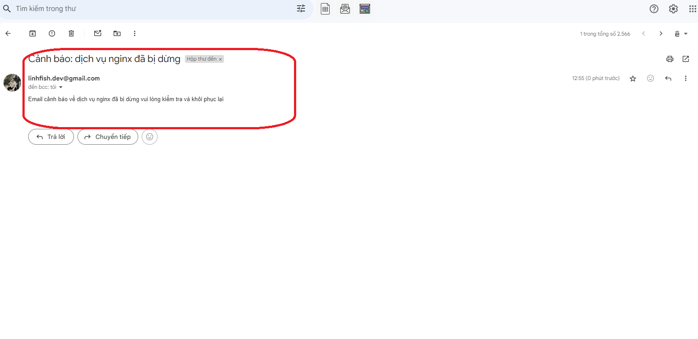

Step1: Cài đặt nginx trên ubuntu ubuntu:
```bash
sudo apt install nginx -y
```
verity nginx

```bash
systemctl status nginx
```
kết quả:



tắt dịch vụ nginx

```bash
sudo systemctl stop nginx
```

verify dịch vụ nginx đã tắt

```bash
systemctl status nginx
```


step2: lấy google credentials để gửi email

Truy cập vào trang myaccount.google.com để lấy credential của gmail và bật xác minh 2 bước google


truy cập màn hình mật khẩu ứng dụng và tạo mật khẩu mới




copy nội dung App password này và lưu lại

step3: cấu hình msmtp sử dung google credentials để gửi email
```bash
sudo apt-get update
sudo apt install msmtp
```

update cấu hình msmtp

```bash
nano ~/.msmtprc
chmod 600 ~/.msmtprc
```


test thử xem gửi email đã hoạt động chưa
```bash
echo "testmail" | msmtp linhfish.dev@gmail.com
```
kết quả:


step3: copy check_nginx.sh tronng folder lab03 và phân quyền thực thi cho check_nginx.sh

```bash
touch check_nginx.sh
chmod +x check_nginx.sh
```
thực thi bash script

```bash
./check_nginx.sh
```
kết quả

