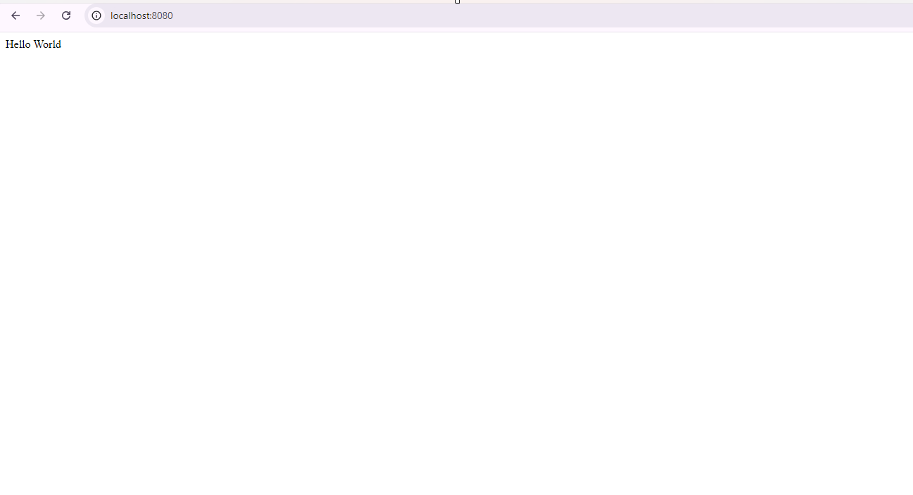

step1: build docker file

```bash
docker build -t flasksampleapp:latest .
```


step2: run container

```bash
docker run -itd -p 8080:8080 --name flaskapp flasksampleapp:latest  
```

kiểm tra kết quả:

