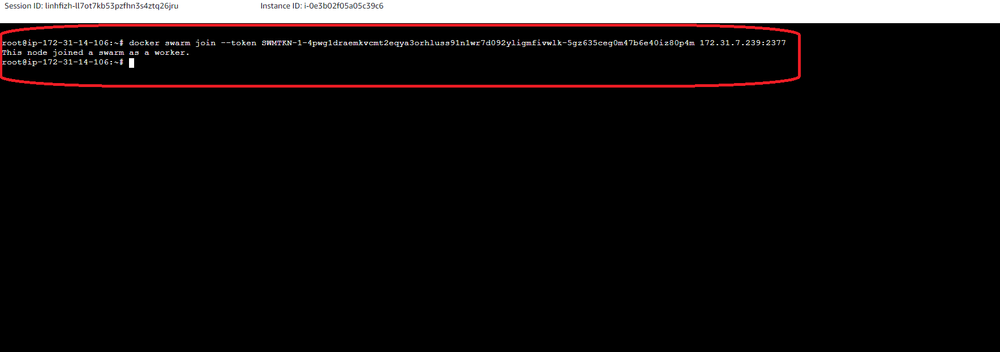

Step1: chạy 3 node ec2 và cài sẵn docker trên 1 VPC default và Security group mặc định cho phép all traffic truy cập

kiểm tra docker đã được cài đặt hay chưa

Kết nối đến ec2 thông qua instance connect và kiểm tra docker đã được cài hay chưa
```bash
docker version
```


khởi chạy master node

```bash
docker swarm init
```


step2: truy cập vào 2 node còn lại

```bash
docker swarm join --token SWMTKN-1-4pwg1draemkvcmt2eqya3orhluss91n1wr7d092yligmfivwlk-5gz635ceg0m47b6e40iz80p4m 172.31.7.239:2377
```



qua màn console của node master kiểm tra xem node đã join thành công hay chưa

```bash
docker node ls
```


step3: tạo mới 1 public docker repository cho việc test


build và push image flask app lên public repository này

```bash
docker login

docker build ducdv1/sampleflaskapp:latest . 

docker push ducdv1/sampleflaskapp:latest
```

