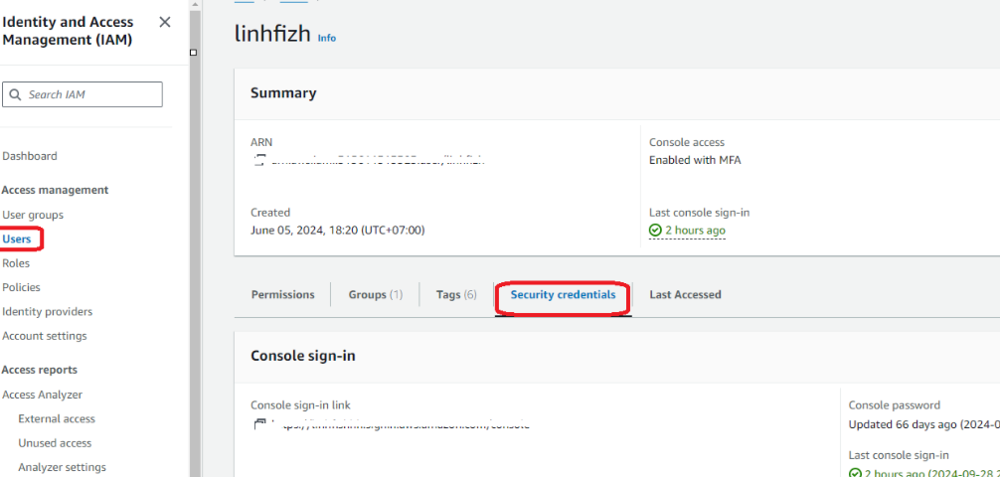
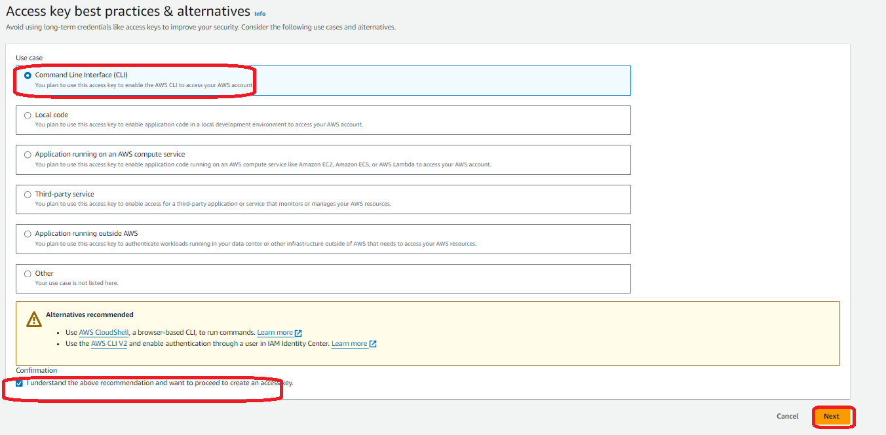
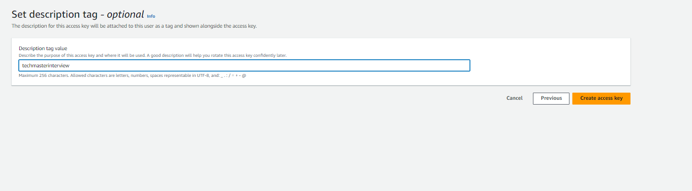
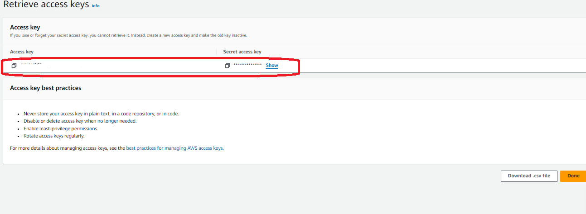
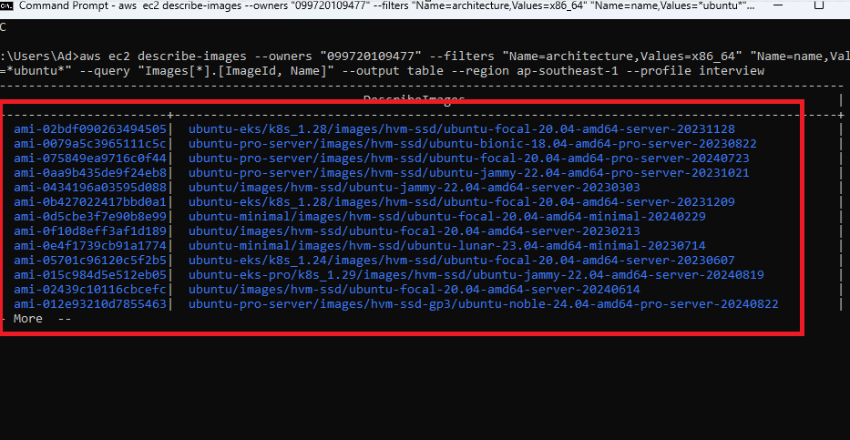
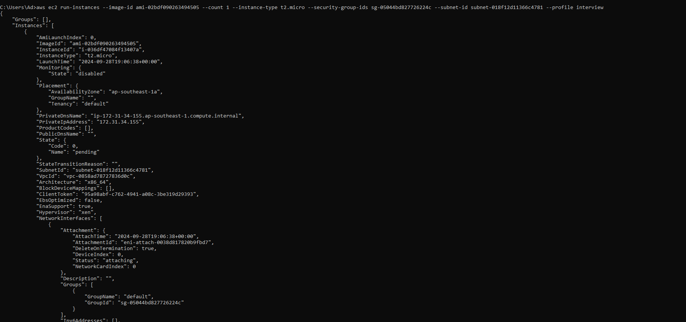
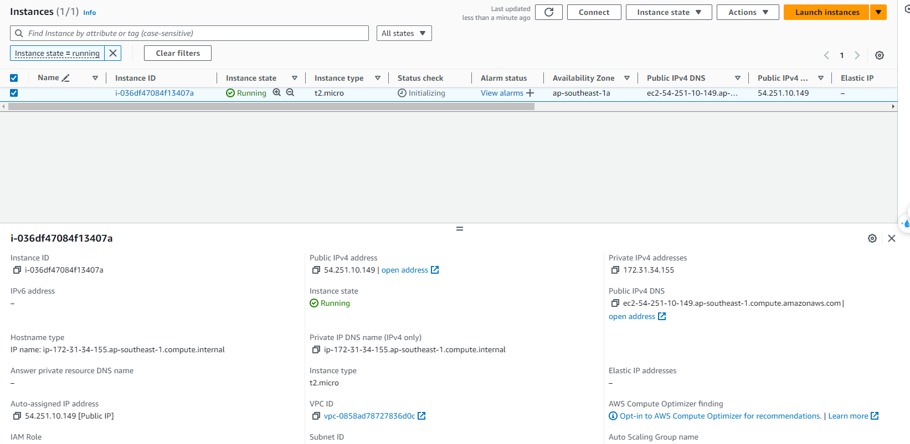

step1: cài đặt và cấu hình awscli ở đây tôi dùng choco để tự động cài đặt awscli

```bash
choco install awscli
```

cấu hình xác thực cho awcli sử dụng access key và secret key
login vào user chọn user -> security credentials









cách cấu hình này đã guide rõ trong document của aws
```bash
aws configure --profile interview
```
**NOTE** lưu ý: mã xác thực này cần có policy để tạo ec2 ở đây mình sử dụng full quyền ec2

step2: tìm kiếm image id với awscli
```
aws ec2 describe-images --owners "099720109477" --filters "Name=architecture,Values=x86_64" "Name=name,Values=*ubuntu*" --query "Images[*].[ImageId, Name]" --output table --region ap-southeast-1 --profile interview
```



tạo ec2 từ ami đó

```bash
aws ec2 run-instances --image-id ami-02bdf090263494505 --count 1 --instance-type t2.micro --security-group-ids 	sg-05044bd827726224c --subnet-id subnet-018f12d11366c4781 --profile interview
```



truy cập vào console và verify kết quả
