Step1: Khởi tạo VPC
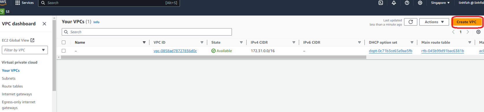

chọn option vpc and more

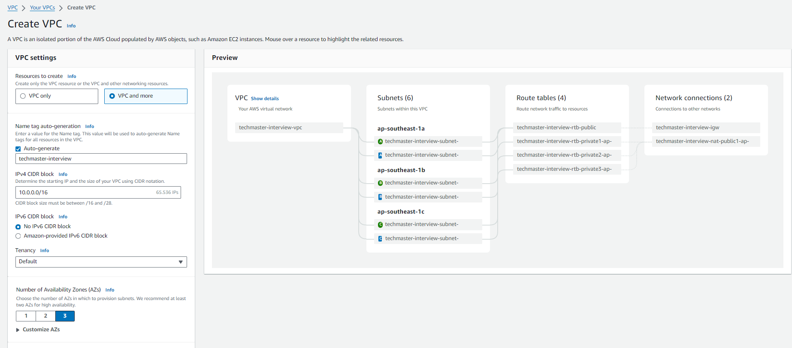

click chọn create

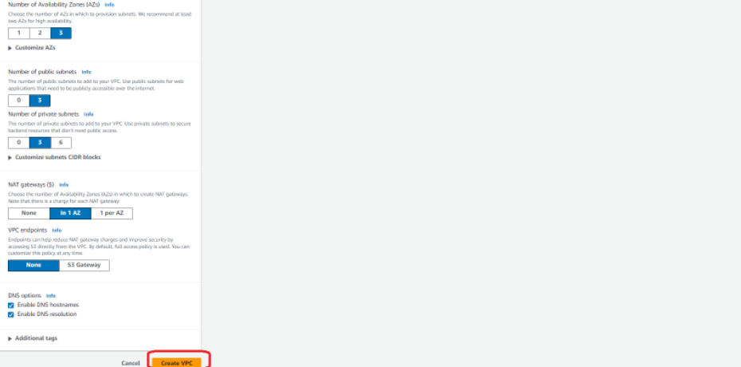

Step2: Tạo launch template

truy cập console dịch vụ EC2 > Autoscaling group > create launch template 

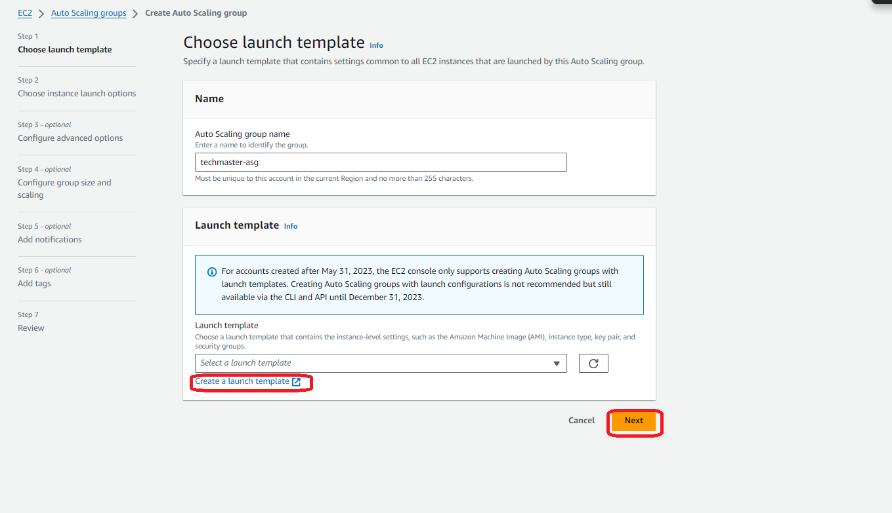

điền các thông số rồi ấn create launch template

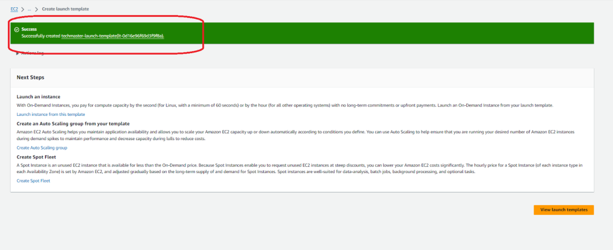

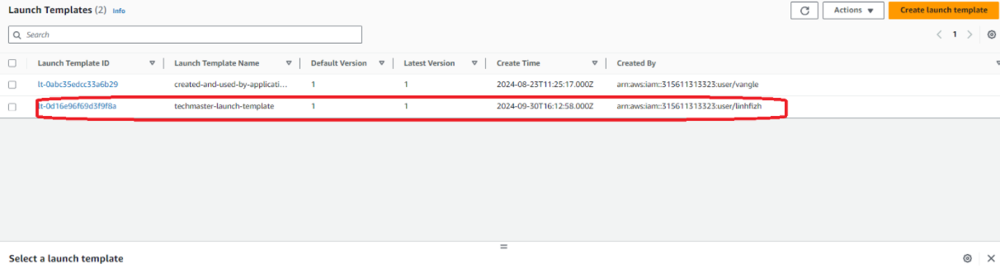

truy cập màn hình autoscaling group chọn create auto scaling group

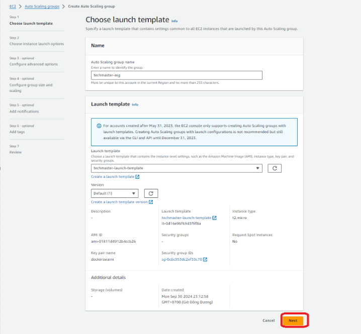

chọn VPC tạo ở bước trước > next

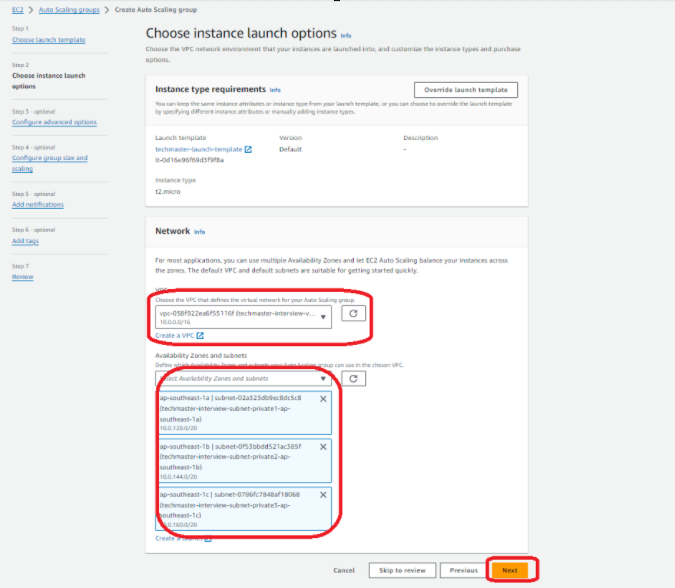

chọn attach new loadbalancer để tạo mới loadbalancer và target group
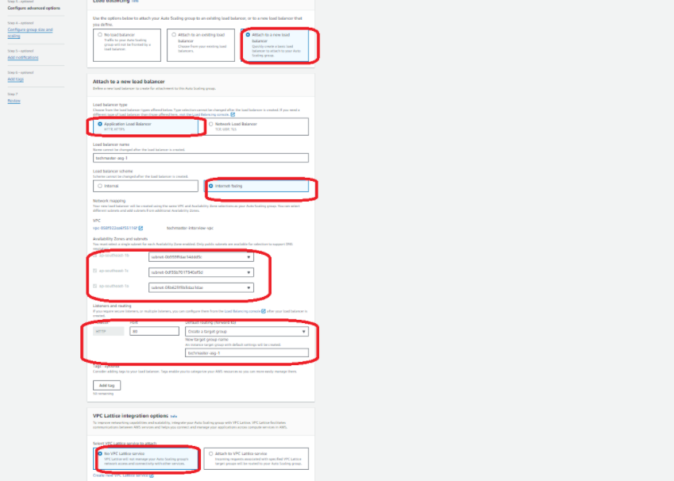

chọn next để tạo resource
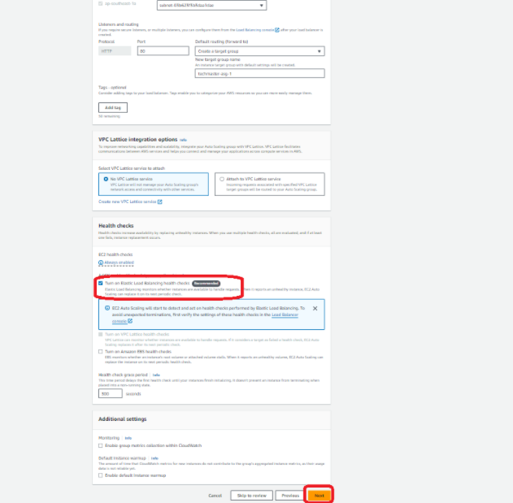

chọn option scaling policy để scale instance và chọn metric là scale theo CPU cấu hình này có nghĩa autoscaling sẽ tự động scale theo chỉ số CPU

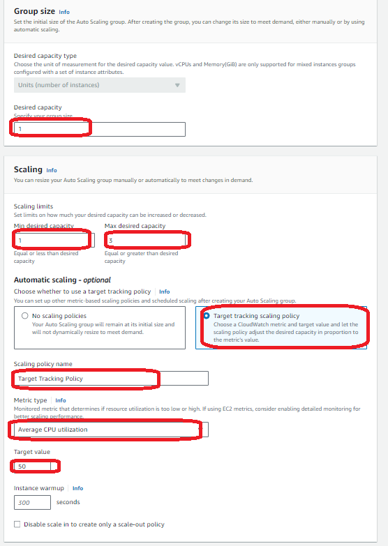

next qua các step và chọn create

Step3: verify thông tin

truy cập vào màn hình ec2 > load balancer
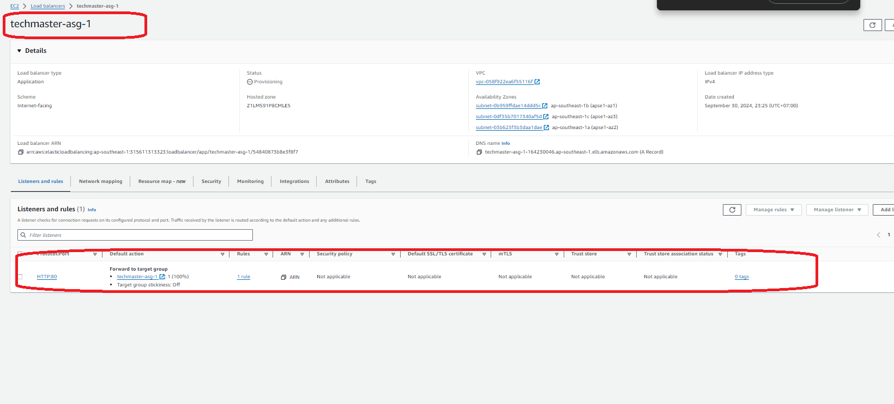

chờ health chekc thành công và truy cập DNS của ALB
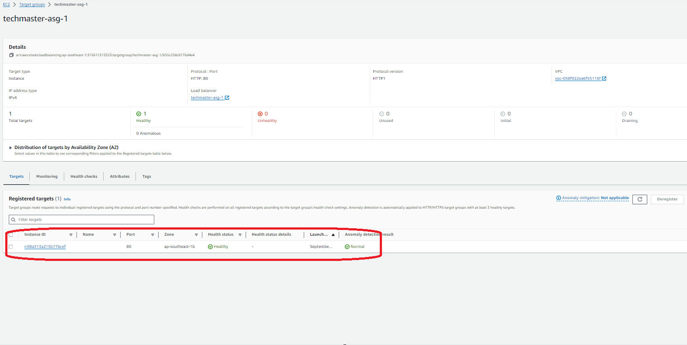

verify kết quả
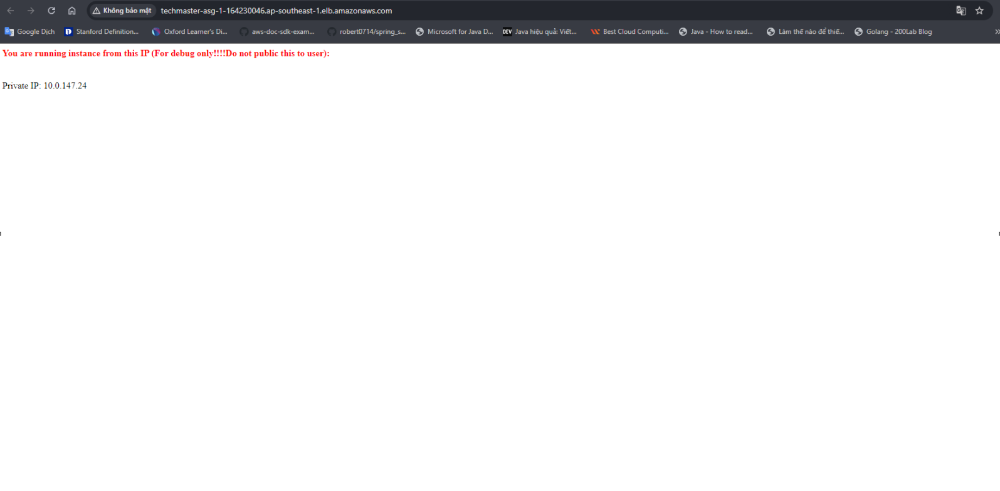

step4: dọn dẹp resource