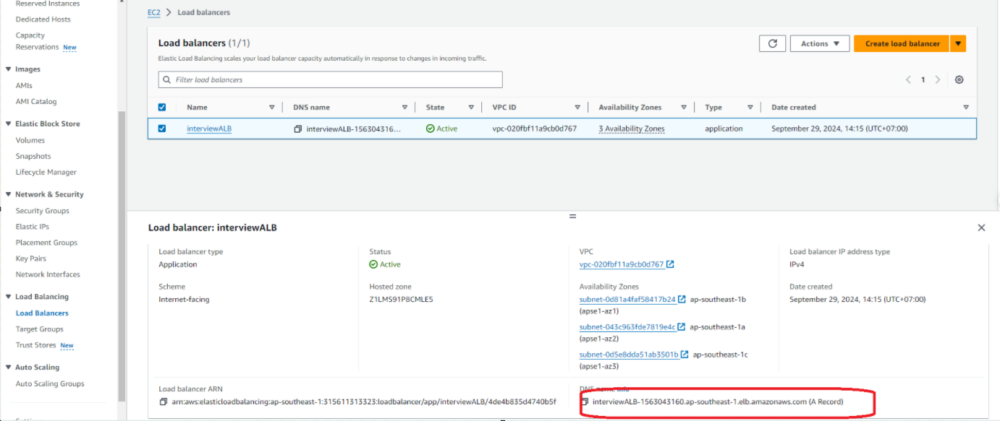
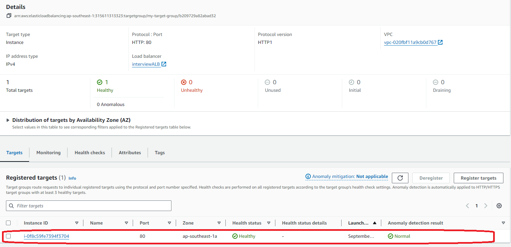
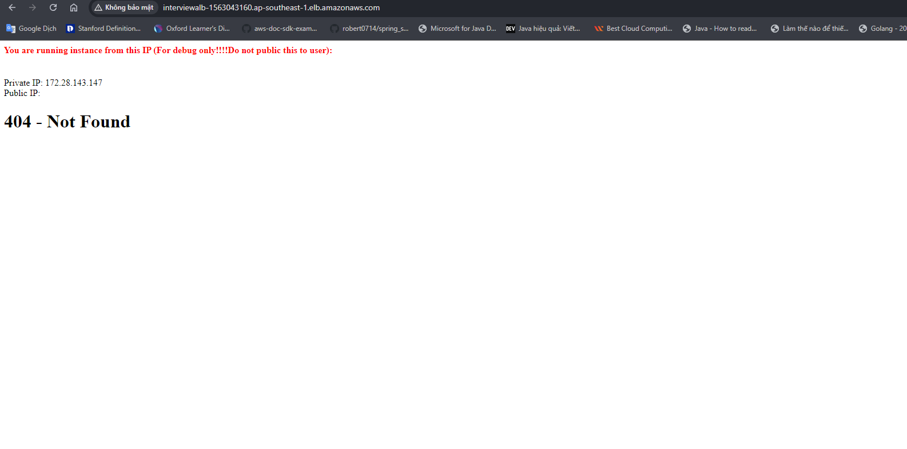

step1: cài đặt terraform cli
```bash
choco install terraform
```
### terraform sẽ tự đọc cấu hình credentials từ khi đã cấu hình aws cli

step2: init provider va kiểm tra những resource sẽ được tạo

```bash
terraform init
terraform plan
```

step3: triển khai resource
```bash
terraform apply --auto-approve
```

kiểm tra kết quả:






step4: dọn dẹp reosurce

```bash
terraform destroy
```
