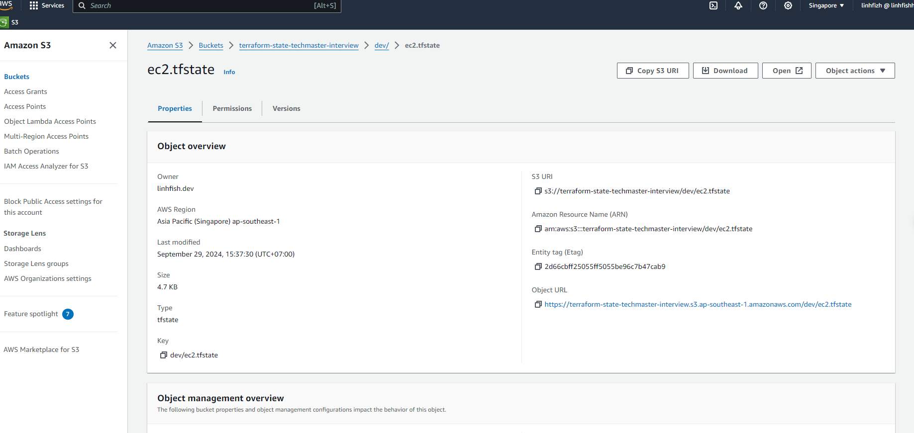

Step1: tạo hạ tầng s3 bucket

chuyển đến folder lab12/source/backend

```bash
terraform init

terraform apply --auto-approve
```

step2: cấu hình backend bằng tệp backend.hcl trong thư mục lab12/source/infrastructure

di chuyển vào thư mục lab12/source/infrastructure

```bash
terraform init -migrate-state
terraform apply --auto-approve
```

kiểm tra kết quả:

state đã đc sync lên s3

step3: dọn dẹp resource
