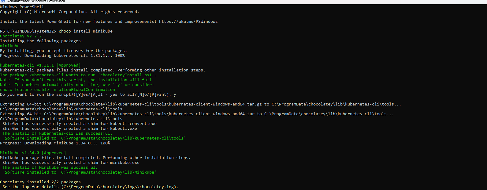

Chuẩn bị:
 - cài đặt sẵn docker 
 - cài đặt sẵn chocolatey

Step1: cài đặt minikube

```bash
choco install minikube
```



Step2: Chạy cụm k8s local
```bash 
minikube start --driver=docker
```


step3: update kubeconfig cho kubectl

```bash
minukube update-context
```

kiểm tra context

```bash
kubectl config current-context
```

kiểm tra cụm k8s đã tạo
```bash
kubectl get nodes
```

