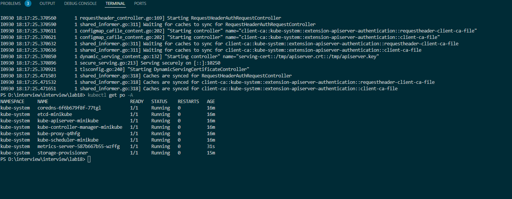
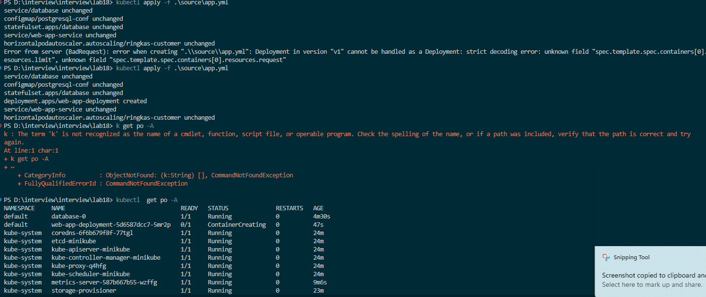
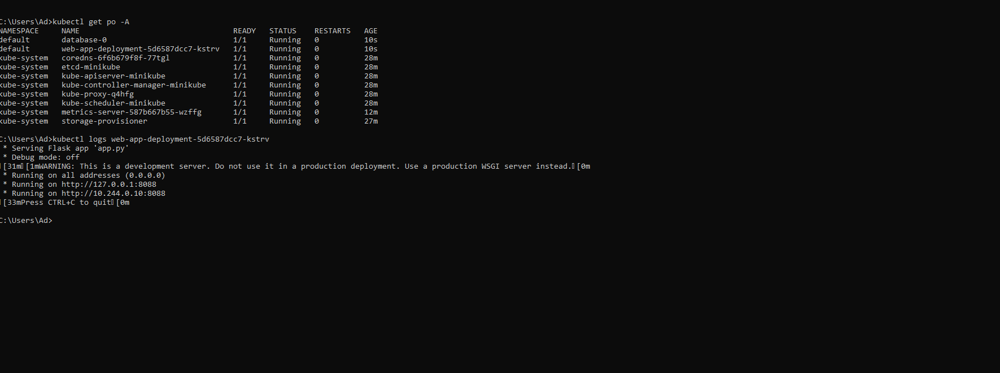

Chuẩn bị 1 cụm cluster có sẵn

Step1: cấu hình metric-server

```bash
kubectl apply -f source/metric-server
```

lưu ý: deployment của metric server phải có option  - --kubelet-insecure-tls


Step2: apply manifest

```bash
kubectl apply -f source/app.yml
```

kiểm tra kết quả



